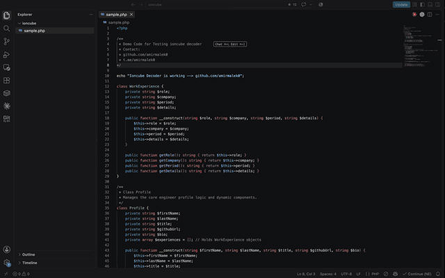

# ionCube Decoder v15

*Click the preview to watch the full-quality video.*

A commercial ionCube decoder that reconstructs readable PHP through a simple
web interface.

## Compatibility

| ionCube Encoder | Verified PHP targets |
| --- | --- |
| 10.2.0 | 7.2 |
| 10.2.2 | 7.1, 7.2 |
| 11.0.2 | 7.1, 7.2 |
| 12.0.2 | 8.1 |
| 13.0.1 | 7.4, 8.1, 8.2 |
| 13.0.2 | 7.1, 7.2, 7.4, 8.1, 8.2 |
| 13.0.3 | 7.4, 8.1, 8.2 |
| 14.0.1 | 7.4, 8.1, 8.2 |
| 14.0.2 | 7.1, 7.2, 7.4, 8.1, 8.2, 8.3 |
| 15.0.1 | 7.1, 7.2, 7.4, 8.1, 8.2, 8.3, 8.4 |

Support depends on the Encoder version, PHP target, and protection options used
for each file.

## Buy the decoder

Contact **[@amirmalek0](https://t.me/amirmalek0)** on Telegram for pricing. The
complete source code is included, with no license-key or activation requirement.
